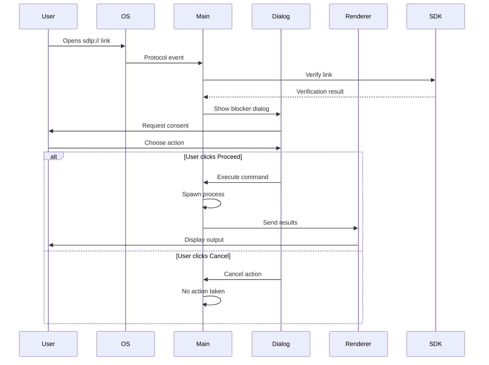
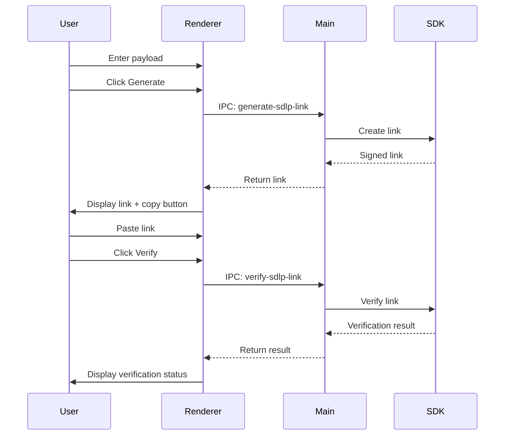

# SDLP Electron Demo Application Architecture

This document describes the architecture and flow of the enhanced SDLP Electron Demo Application implemented in Phase 6.

## System Architecture

```mermaid
graph TB
    subgraph "Operating System"
        OS[OS Deep Link Handler]
        Browser[Browser/Terminal]
    end
    
    subgraph "Electron Application"
        subgraph "Main Process"
            Protocol[Protocol Handler]
            Dialog[Blocker Dialog]
            IPC_Main[IPC Handlers]
            SDLP_Main[SDLP Verification]
            Exec[Command Execution]
        end
        
        subgraph "Preload Script"
            Bridge[Context Bridge]
        end
        
        subgraph "Renderer Process"
            UI[User Interface]
            Tabs[Tab Navigation]
            Home[Home Tab]
            Tester[Tester Tab]
            Generator[Link Generator]
            Verifier[Link Verifier]
        end
    end
    
    subgraph "External Dependencies"
        SDK[@sdlp/sdk]
        CLI[SDLP CLI Tools]
    end
    
    %% Deep Link Flow
    Browser -->|sdlp:// link| OS
    OS -->|Protocol Event| Protocol
    Protocol -->|Verify Link| SDLP_Main
    SDLP_Main -->|Show Dialog| Dialog
    Dialog -->|User Choice| Exec
    Exec -->|Results| IPC_Main
    IPC_Main -->|Send Results| Bridge
    Bridge -->|Display| UI
    
    %% Interactive Flow
    UI <-->|Tab Switch| Tabs
    Tabs -->|Show Content| Home
    Tabs -->|Show Content| Tester
    Tester -->|Generate| Generator
    Tester -->|Verify| Verifier
    Generator -->|IPC Call| IPC_Main
    Verifier -->|IPC Call| IPC_Main
    IPC_Main <-->|SDK Calls| SDK
    
    %% External Integration
    CLI -->|Test Links| Browser
    SDK -->|Verification| SDLP_Main
```

## Component Descriptions

### Main Process Components

#### Protocol Handler
- Registers the application as the default handler for `sdlp://` protocol
- Captures deep link events from the operating system
- Supports both macOS (`open-url` event) and Windows/Linux (command line arguments)

#### Blocker Dialog
- **Purpose**: Provides user consent before executing any commands from deep links
- **Features**:
  - Shows full SDLP link details
  - Displays verification status (Valid, Invalid, Untrusted)
  - Shows sender DID and decoded payload
  - Provides "Proceed" and "Cancel" options
  - Disables "Proceed" for invalid links

#### IPC Handlers
- `generate-sdlp-link`: Creates signed SDLP links using test key fixtures
- `verify-sdlp-link`: Verifies SDLP links and returns detailed results
- Handles secure communication between main and renderer processes

#### SDLP Verification
- Uses `@sdlp/sdk` for cryptographic verification
- Validates signatures, checksums, and DID resolution
- Handles different verification states (valid, invalid, expired, etc.)

#### Command Execution
- Safely executes commands using `child_process.spawn`
- Captures stdout and stderr for display
- Only executes after user consent via blocker dialog

### Renderer Process Components

#### User Interface
- **Technology**: HTML, CSS (Tailwind), TypeScript
- **Layout**: Clean, responsive design with tabbed navigation
- **Styling**: Professional appearance with appropriate visual feedback

#### Tab Navigation
- Two main tabs: "Home" and "Tester"
- Smooth transitions between tabs
- Maintains state within each tab

#### Home Tab
- **Protocol Introduction**: Educational content about SDLP benefits
- **Example Links**: Pre-built test scenarios:
  - Valid link demonstration
  - Invalid link (bad signature) demonstration  
  - Untrusted link (unknown sender) demonstration
- **Status Display**: Real-time verification results and command output

#### Tester Tab
- **Link Generator**:
  - Text area for payload input
  - Generate button to create signed links
  - Copy-to-clipboard functionality
  - Real-time feedback and error handling
- **Link Verifier**:
  - Input field for SDLP links
  - Verification button
  - Detailed results display with sender info and payload

### Preload Script
- **Context Bridge**: Securely exposes IPC functionality to renderer
- **Security**: Maintains Electron's security model with context isolation
- **API Surface**: Limited, secure interface for renderer-main communication

## Data Flow Diagrams

### Deep Link Processing Flow



### Interactive Testing Flow



## Security Considerations

### Implemented Security Measures
1. **User Consent**: Blocker dialog prevents automatic command execution
2. **Context Isolation**: Renderer process is sandboxed with limited IPC access
3. **Input Validation**: All inputs are validated before processing
4. **Secure IPC**: Limited, well-defined communication channels
5. **Process Isolation**: Commands executed in separate child processes

### Security Features by Component
- **Main Process**: Handles all privileged operations (file system, process spawning)
- **Renderer Process**: Sandboxed UI with no direct system access
- **Preload Script**: Minimal, secure API surface for IPC communication
- **Blocker Dialog**: Native OS dialog for secure user consent

## Integration Points

### SDLP SDK Integration
- **Link Creation**: Uses `createLink` with test key fixtures
- **Link Verification**: Uses `verifyLink` for cryptographic validation
- **DID Resolution**: Automatic resolution of sender DIDs
- **Error Handling**: Comprehensive error types and messages

### External Tool Integration
- **CLI Tools**: Can generate test links for the application
- **System Integration**: Registered as default protocol handler
- **Cross-Platform**: Supports macOS, Windows, and Linux

## Future Enhancement Opportunities

1. **Enhanced Security**:
   - Command sandboxing with restricted environments
   - Allow-listing of permitted commands
   - Enhanced user permission management

2. **User Experience**:
   - Command history and logging
   - Configuration management for trusted senders
   - Notification system integration

3. **Developer Features**:
   - Advanced debugging tools
   - Link inspection and analysis tools
   - Batch testing capabilities

4. **Enterprise Features**:
   - Policy management
   - Audit logging
   - Integration with enterprise identity systems
