# SDLP Ecosystem Architecture

This diagram shows the relationship between the main components of the SDLP ecosystem and how they work together.

```mermaid
graph TD
    %% User/Developer Layer
    User[👤 Developer/User]
    DevOps[🔧 DevOps/CI Pipeline]
    App[📱 End User App]

    %% CLI Tools Layer
    CLI[🛠️ SDLP CLI<br/>Command Line Tool]
    
    %% Core Library Layer
    SDK[📚 SDLP SDK v1.0<br/>TypeScript Library]
    
    %% Protocol Layer
    Protocol[📋 SDLP v1.0 Protocol<br/>Specification]
    
    %% Demo/Reference Layer
    Demo[🎯 Demo Application<br/>Reference Implementation]
    
    %% External Dependencies
    DIDResolver[🔍 DID Resolver<br/>did:key, did:web]
    JWS[🔐 JOSE Library<br/>JWS Signing/Verification]
    Compression[🗜️ Brotli/Gzip<br/>Compression]
    
    %% Connections from Users
    User -->|Uses for development| CLI
    DevOps -->|Automation & signing| CLI
    App -->|Integrates for SDLP support| SDK
    User -->|Studies implementation| Demo
    
    %% CLI Dependencies
    CLI -->|Uses for all operations| SDK
    CLI -->|Generates keys, signs, verifies| SDK
    
    %% SDK Dependencies
    SDK -->|Implements| Protocol
    SDK -->|Resolves DIDs| DIDResolver
    SDK -->|JWS operations| JWS
    SDK -->|Payload compression| Compression
    
    %% Demo Dependencies
    Demo -->|Built with| SDK
    Demo -->|Demonstrates| Protocol
    
    %% Protocol Foundation
    Protocol -->|Defines standards for| DIDResolver
    Protocol -->|Specifies use of| JWS
    Protocol -->|Defines compression| Compression

    %% Styling
    classDef userLayer fill:#e1f5fe,stroke:#01579b,stroke-width:2px
    classDef toolLayer fill:#f3e5f5,stroke:#4a148c,stroke-width:2px
    classDef coreLayer fill:#e8f5e8,stroke:#1b5e20,stroke-width:2px
    classDef protocolLayer fill:#fff3e0,stroke:#e65100,stroke-width:2px
    classDef externalLayer fill:#fce4ec,stroke:#880e4f,stroke-width:2px

    class User,DevOps,App userLayer
    class CLI,Demo toolLayer
    class SDK coreLayer
    class Protocol protocolLayer
    class DIDResolver,JWS,Compression externalLayer
```

## Component Descriptions

### 🛠️ SDLP CLI
**Purpose**: Command-line tool for developers and automation
- **Key Commands**: `keygen`, `sign`, `verify`
- **Use Cases**: Development workflow, CI/CD pipelines, manual testing
- **Architecture**: TypeScript application using Commander.js
- **Dependencies**: Built on top of SDLP SDK

### 📚 SDLP SDK v1.0
**Purpose**: Core TypeScript library implementing the SDLP specification
- **Key Functions**: `createLink()`, `verifyLink()`
- **Features**: Full SDLP v1.0 support, pluggable DID resolution, compression
- **Architecture**: Modular TypeScript library with comprehensive error handling
- **Dependencies**: JOSE for JWS, did-resolver ecosystem, brotli-wasm

### 🎯 Demo Application
**Purpose**: Reference implementation and integration example
- **Features**: Interactive SDLP link creation and verification
- **Use Cases**: Learning tool, integration reference, testing
- **Architecture**: Web application built with SDLP SDK
- **Value**: Shows real-world usage patterns

### 📋 SDLP v1.0 Protocol
**Purpose**: Formal specification defining the protocol
- **Scope**: Link format, cryptographic requirements, security model
- **Standards**: JWS, DIDs, compression algorithms
- **Compliance**: All components implement this specification

## Data Flow Examples

### Link Creation Flow

### Link Verification Flow

## Integration Patterns

### Developer Workflow
1. **Development**: Use CLI for testing and development
2. **Integration**: Import SDK into applications
3. **Reference**: Study Demo app for implementation patterns
4. **Deployment**: Use CLI in CI/CD for automated signing

### Application Integration
1. **Install**: Add SDLP SDK as dependency
2. **Configure**: Set up DID resolver and compression options
3. **Implement**: Use `createLink()` and `verifyLink()` functions
4. **Customize**: Extend with application-specific validation

This architecture ensures a cohesive ecosystem where each component serves specific needs while building on shared foundations.
