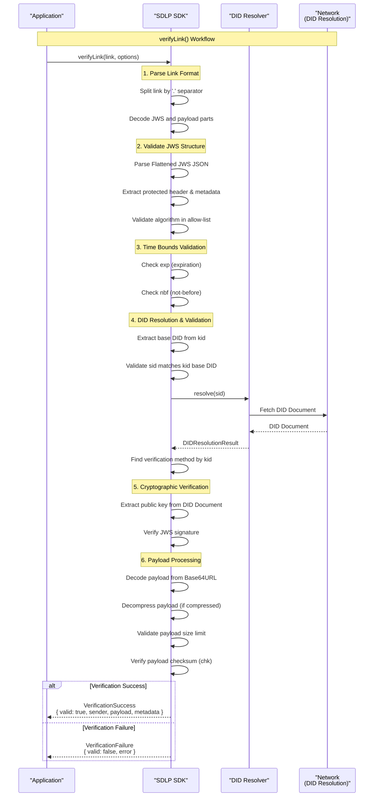

# verifyLink Workflow Sequence Diagram

This diagram shows the complete workflow for verifying a Secure Deep Link, including the interaction between the SDLP SDK, DID resolver, and network components.

## Workflow Steps

1. **Parse Link Format**: The SDK splits the SDLP link by the first '.' separator to extract the JWS and payload components, then decodes them from Base64URL.

2. **Validate JWS Structure**: The JWS component is parsed as Flattened JSON Serialization format, and the protected header and metadata are extracted and validated.

3. **Time Bounds Validation**: If present, the expiration (`exp`) and not-before (`nbf`) timestamps are checked against the current time.

4. **DID Resolution & Validation**: The sender's DID is resolved to obtain the DID Document, and the key specified in the `kid` field is located and validated.

5. **Cryptographic Verification**: The JWS signature is cryptographically verified using the sender's public key from the DID Document.

6. **Payload Processing**: The payload is decoded, decompressed (if necessary), size-validated, and its integrity is verified using the checksum.

The workflow returns either a `VerificationSuccess` result with the verified data or a `VerificationFailure` result with a structured error.
